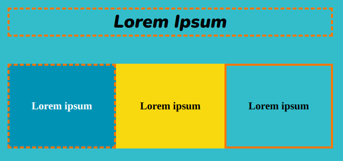

Utilise la classe `solid-border` ou `dashed-border` pour ajouter une bordure solide ou en pointillés autour d'un `<section>` ou d'un `
`. Les bordures utilisent la couleur `detail2`.

## --- code ---

language: html
filename: index.html
line_numbers: false
--------------------------------------------------------

<section>
    <h2 class="xcenter dashed-border">Lorem Ipsum</h2>
</section>

<section class="wrap">
    

        <h3>Lorem ipsum</h3>
    

    

        <h3>Lorem ipsum</h3>
    

    

        <h3>Lorem ipsum</h3>
    
 
</section>

\--- /code ---

**Astuce :** tu peux ajuster les valeurs de `border` pour les classes `solid-border` et `dashed-border` dans `style.css`.
