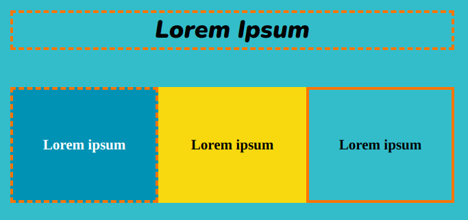

Gebruik de `solid-border` of `dashed-border` class om een effen of gestippelde rand toe te voegen rond een `<section>` of `
`. De randen gebruiken de `detail2` kleur.

## --- code ---

language: html
filename: index.html
line_numbers: false
--------------------------------------------------------

<section>
    <h2 class="xcenter dashed-border">Lorem Ipsum</h2>
</section>

<section class="wrap">
    

        <h3>Lorem ipsum</h3>
    

    

        <h3>Lorem ipsum</h3>
    

    

        <h3>Lorem ipsum</h3>
    
 
</section>

\--- /code ---

**Tip:** Je kunt de `border` waarden aanpassen voor de `solid-border` en `dashed-border` classes in `style.css`.
