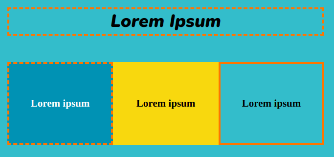

使用 `solid-border` 或 `dashed-border` 类在 `<section>` 或 `
` 周围添加实线或虚线边框。 边框使用 `detail2` 颜色。

## --- code ---

language: html
filename: index.html
line_numbers: false
--------------------------------------------------------

<section>
    <h2 class="xcenter dashed-border">Lorem Ipsum</h2>
</section>

<section class="wrap">
    

        <h3>Lorem ipsum</h3>
    

    

        <h3>Lorem ipsum</h3>
    

    

        <h3>Lorem ipsum</h3>
    
 
</section>

\--- /code ---

**提示**：你可以调整 `style.css` 中 `solid-border` 和 `dashed-border` 类的 `border` 值。
